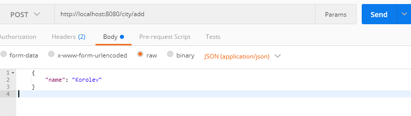
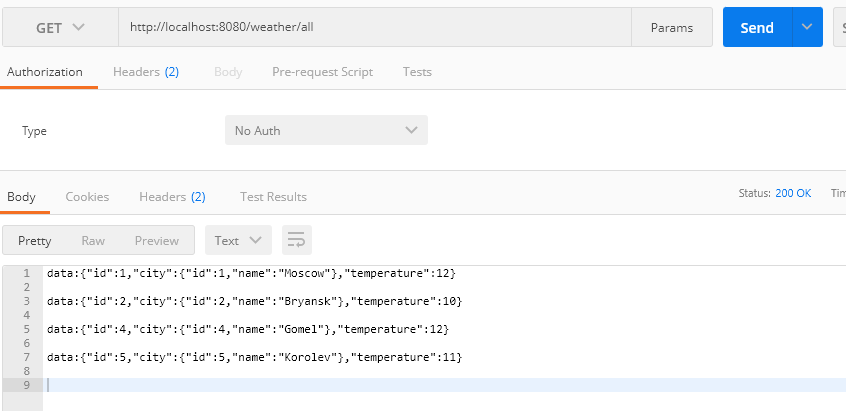
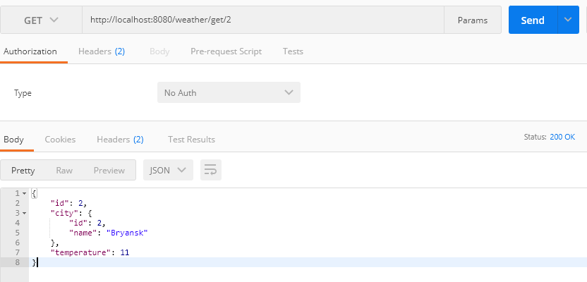
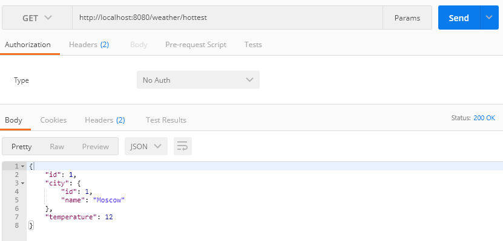
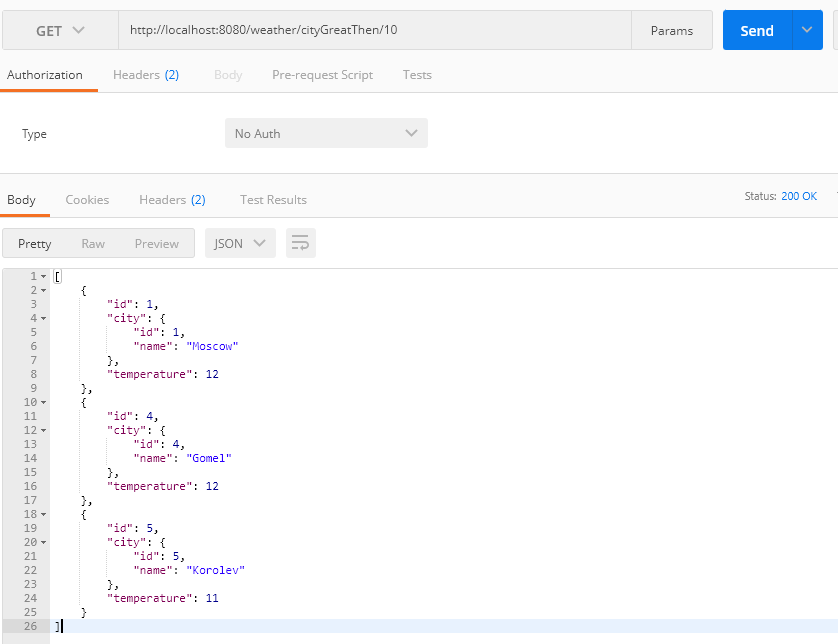

# Прогноз погоды.
Основная задача - это изучить и научиться применять ***Spring WebFlux*** в RESTFull приложения. Разработанный web проект позволяет предоставлять информацию о погоде на данный момент времени.

#### Инструменты:
В данном проекте использовались следующие инструменты:      
1) IntelliJ Idea    
2) Gradle        
3) PostgreSQL      
 
При вызове Post метода http://localhost:8080/city/add, с указанием в теле метода название соответствующего города, приложение позволяет добавлять название города в БД. 
  
При вызове Get метода http://localhost:8080/weather/all , приложение запросит текущую температуры ***всех*** городов и выведет результат на экран(список городов приложение берёт из БД). Информация о температуре запрашивается каждый раз, как только пользователь делает запрос.  
  
При вызове Get метода http://localhost:8080/weather/get/{id}  ({id} - id конкретного города), приложение запросит текущую температуру ***конкретного*** города и выведет результат на экран.  
  
При вызове Get метода http://localhost:8080/weather/hottest приложение позволяет запрашивать информацию о городе с самой высокой температурой, которые были добавлены в БД, данная информация передаётся пользователю.  
  
При вызове Get метода http://localhost:8080/weather/cityGreatThen/{amount} ({amount} - значение температуры), приложение позволяет запрашивать информацию о городах с температурой выше, чем указано в запросе, информация о городах передаётся пользователю.  
  

